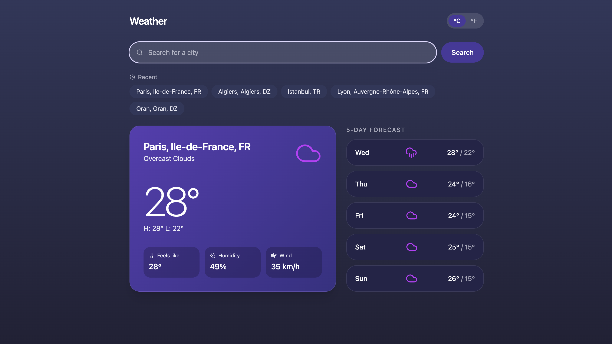

# Weather Forecast App

A small weather app: search a city, get the **current conditions** and a **5-day forecast**, toggle °C/°F, and jump back to recent searches.



Source brief: [`weather_forecast.md`](./weather_forecast.md).

## Getting started

```bash
npm install
cp .env.example .env.local   # then paste your OpenWeatherMap API key
npm run dev
```

Get a free API key at [openweathermap.org](https://home.openweathermap.org/api_keys) (activation can take a couple of hours). Other scripts: `npm test`, `npm run lint`, `npm run format`, `npm run build`.

## How it works

```
SearchBar ──▶ WeatherView ──▶ RTK Query (weatherApi) ──▶ OpenWeatherMap
                    │              │                      (geocode → current + forecast)
                    │              └─▶ mappers ─▶ domain models
                    ▼                             (5-day aggregation, °C/°F)
              empty / loading / error / success
                    ▲
   Redux store ─────┘  (unit preference + recent searches, persisted to localStorage)
```

- **Server state** (weather data) lives in RTK Query, cached as fresh for 30 minutes and retained for 1 hour. Re-searching the same city in that window does not hit the API.
- **Client state** (unit preference, recent searches) lives in two Redux Toolkit slices, persisted to `localStorage`. The API cache is not persisted.
- The free API returns the forecast in 3-hour slots; grouping them into five daily summaries (min/max, dominant condition, city-local days) is our own pure, unit-tested code.
- Temperatures are fetched once in metric and converted client-side on toggle — no refetch.

```
src/
  app/                  Redux store, typed hooks
  features/
    weather/            RTK Query API, DTOs, domain (mappers, aggregation), UI
    preferences/        unit slice + °C/°F toggle
    search-history/     history slice + recent-search chips
  components/           error boundary + tiny shared primitives
  test/                 Vitest setup
```

Each decision (API endpoints, RTK Query cache, why Redux for so little, custom UI) has a short note in [`docs/decisions.md`](./docs/decisions.md).

## Testing

Vitest + React Testing Library. One unit test covers grouping the 3-hour forecast into daily min/max; one integration test covers the °C/°F toggle against a real Redux store. `npm test` runs both; CI runs lint + tests on every push.

## Credits

UI adapted from a community Figma design ([Weather App UI Design](https://www.figma.com/community/file/1100826294536456295)); desktop layout loosely inspired by [Web App UI Design](https://www.figma.com/community/file/1116248614926294639). Icons by [lucide](https://lucide.dev/).
